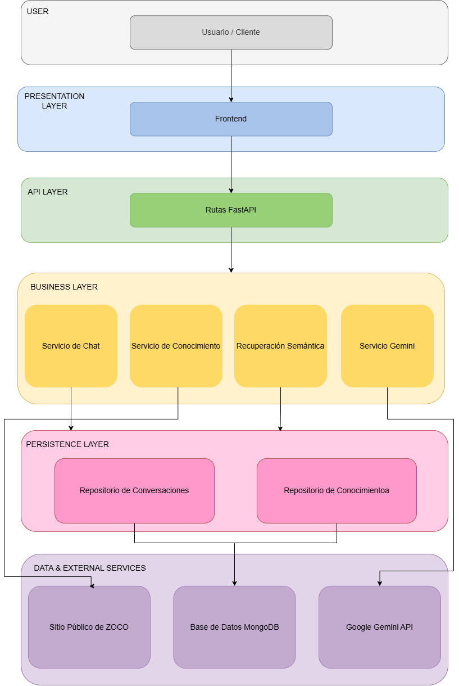

# ZOCO AI Assistant

A conversational assistant that answers questions about ZOCO Pagos using information collected from its public website.

The solution generates grounded answers, displays the sources consulted, maintains conversation context, and redirects users to human support when it cannot answer safely.

## Demo video

[Watch the presentation and demonstration video](https://frtutneduar-my.sharepoint.com/:v:/g/personal/ariadna_cisternadiaco_alu_frt_utn_edu_ar/IQA3VhTLzFhTR50vfWur4tMGAatk-zQAkG51Wc97dXN8nAI?nav=eyJyZWZlcnJhbEluZm8iOnsicmVmZXJyYWxBcHAiOiJPbmVEcml2ZUZvckJ1c2luZXNzIiwicmVmZXJyYWxBcHBQbGF0Zm9ybSI6IldlYiIsInJlZmVycmFsTW9kZSI6InZpZXciLCJyZWZlcnJhbFZpZXciOiJNeUZpbGVzTGlua0NvcHkifX0&e=YBB3Ul)

## Features

- Automatic knowledge updates.
- Conversational memory.
- Answers grounded in public ZOCO content.
- Source links included with supported answers.
- Safe fallback to human support.
- Responsive chat interface.

## Architecture



The solution consists of:

- a frontend developed with React;
- an API developed with FastAPI;
- services for chat and knowledge management;
- MongoDB for storing knowledge and conversations;
- Google Gemini for embeddings and answer generation;
- the public ZOCO website as the information source.

## Technologies

- React
- TypeScript
- Vite
- Python
- FastAPI
- MongoDB
- Google Gemini
- Playwright
- Beautiful Soup
- Docker

## Requirements

The following tools are required to run the project:

- Python 3.12
- Node.js 22 or later
- Docker with Docker Compose
- Git
- A Google Gemini API key

The following instructions use Windows PowerShell.

## Local setup

### 1. Clone the repository

```powershell
git clone https://github.com/ariadnacisterna/zoco-ai-assistant.git
cd zoco-ai-assistant
```

### 2. Start MongoDB

From the project root:

```powershell
docker compose up -d mongodb
```

### 3. Configure the backend

```powershell
cd backend
python -m venv .venv
.\.venv\Scripts\Activate.ps1
python -m pip install -r requirements.txt
python -m playwright install chromium
Copy-Item .env.example .env
```

Open `backend/.env` and replace the example `GEMINI_API_KEY` value with a valid API key.

### 4. Start the backend

From the `backend` directory:

```powershell
fastapi dev app/main.py
```

The API will be available at:

```text
http://localhost:8000
```

The interactive API documentation will be available at:

```text
http://localhost:8000/docs
```

The first startup may take a few moments while the system collects and processes public ZOCO information.

### 5. Configure and start the frontend

Open another terminal from the project root:

```powershell
cd frontend
npm ci
Copy-Item .env.example .env
npm run dev
```

Open the application at:

```text
http://localhost:5173
```

## Stopping the application

Stop the frontend and backend with `Ctrl+C`.

To stop MongoDB:

```powershell
docker compose down
```